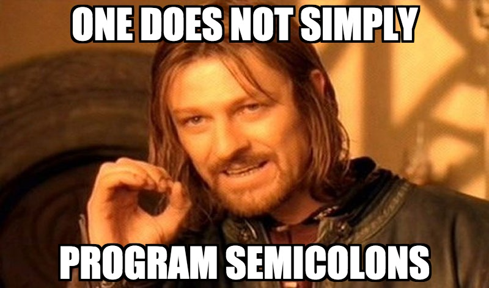

```scala
for {
  comprehensions <- Scala Night @ Stash, May 22nd, 2018
 } yield [fun](https://github.com/ASRagab/for-comprehensions-for-fun)
```

---

## browsing github, as one does

```scala
  private def fromPath(basePath: BasePath)(pathDef: (String, PathItem)) = {
    implicit val (url, path) = pathDef
    for {
      operationName       <- path.operationNames
      verb                <- verbFromOperationName(operationName)
      operation           = path.operation(operationName)
      namePrefix          = base / "paths" / url / operationName
      astPath             = uriFragmentToReference(url)
      params              = parameters(path, operation, namePrefix)
      handlerCall         <- handler(operation, path, params, operationName, astPath).toSeq
      (types, states)     = resultTypes(namePrefix, operation)
      (mimeIn, mimeOut)   = mimeTypes(operation)
      errMappings         = errorMappings(path, operation)
      security            = securityRequirements(operation)
    } yield ApiCall(verb, Path(astPath), handlerCall, mimeIn, mimeOut, errMappings, types, states, security.toSet)
  }
```

[Api-First-Hand | Zalando](https://github.com/ebowman/api-first-hand/blob/b863a05a39debfb351505ca3a9fdfe97d1aaf967/swagger-parser/src/main/scala/de/zalando/swagger/PathsConverter.scala#L29)

---


---

## a for comprehension is not a for-loop

```scala
//Scala has "traditional" for loops
for (x <- List(1, 2, 3)) {
  print(x)
}
//Outputs:
123
```

@[1](The for loop is not an expression but evaluates an expression `0..n` times based on an iteration condition)

---

## for comprehensions are expressions

```scala
val x = Some(10)
val y = Some(20)
val z = Some(30)

val result = for {
  i <- x
  j <- y if j < 21
  k <- z
  t = i * j
} yield i + j + k - t
```

@[5](the return type of result is `Option[Int]`)

---

## syntactic sugar

> In computer science, syntactic sugar is syntax within a programming language that is designed to make things easier to read or to express. It makes the language "sweeter" for human use: things can be expressed more clearly, more concisely...

---

## just sugar for `flatMap`, `map`, and `withFilter`

Using desugar in IntelliJ

```scala
  x.flatMap((i: Int) => y.withFilter((j: Int) => j < 21)
    .flatMap((j: Int) => z.map { k: Int =>
      val t = i * j;
      Tuple2(k, t) }
      .map({ case (t, k: Int) => i + j + k - t }))) 
```

---

### slightly less desugared version

```scala
x.flatMap { i =>
    y.withFilter(j => j < 21).flatMap {j =>
      z.map { k =>
        val t = i * j
        (k, t)
      }.map { case (k, t) => i + j + k - t }
    }
  }

```

---

## syntax rules

1. Left Arrow (`<-`) typically calls `flatMap`

1. Equal signs are a basic assignment to `val`

1. `if` at the end of a line is a `filter` or `withFilter`

1. `yield` at the end calls map

---

## you get what you give

At the beginning of a comprehension if you start with a `List`, you will get typically get back a `List`, if you started with an `Option`, you will usually get back an `Option`

---

## extended example

---

## sending postcards

```scala
  case class Postcard(msg: String, landmark: String, recipient: String)
  case class Sender(name: String)

  val landmarks = List("Grand Canyon", "Niagra Falls", "America's Largest McDonald's")
  val recipients = List("Mom", "Dad", "Uncle Robert", "Aunt Leslie")
  val senders   = List(Sender("TJ"), Sender("Samantha"))
```

---

## using (multiple) for loops

```scala
  var postcardsBuffer = List[Postcard]()
  for(sender <- senders) {
    for(recipient <- recipients) {
      if(recipient != "Aunt Leslie") {
        for(landmark <- landmarks) {
          val msg = s"Dear $recipient, Wish you were here at the $landmark with me, miss you! Love, ${sender.name}"
          val postcard = Postcard(msg, landmark, recipient)
          postcardsBuffer ::= postcard
        }
      }
    }
  }
```

@[8](Note here the need to mutate state, the list of postcards has to be updated inside the nested for loop)

---

## with a for comprehension

```scala
val postcards = for {
    sender    <- senders
    recipient <- recipients if recipient != "Aunt Leslie"
    landmark  <- landmarks
    msg       = s"Dear $recipient, Wish you were here at the $landmark with me, miss you! Love, ${sender.name}"
  } yield Postcard(msg, landmark, recipient)
```

@[1-6](While the code isn't much shorter in this case, it is much flatter, and no mutable state)

---

## monadic comprehensions

---


---


---

## monads as programmable semicolons

---



---

## c#: monadic composition as sql w/linq

---

```csharp
var tokens = from l in text
             from w in l.Split(' ')  // Will resolve to SelectMany, which is flatMap
             where w.startsWith('a') // if or filter
             select w;               // yield or map
```

---

## haskell: monadic composition as imperative-like computation w/ do notation

---

```haskell
tokens = do
  l    <- lines text
  ws   <- words l                              --flatMap
  w    <- filter ('a' `isPrefixOf`) ws         --filter obvs
  return w                                     --return is like yield NOT like C-Style return
```

---

## tldr

Monadic comprehensions allow you to sequence a series of operations on values inside a context
without dealing particularly with that context. The `for-yield` notation and its relatives, allow you to operate
in that context without dealing particularly with the fact that it's a Monad.

---

## resources

- [Using For Comprehensions in Scala](https://eddmann.com/posts/using-for-comprehensions-in-scala/)
- [What is LINQ, Really?](https://github.com/louthy/language-ext/wiki/Thinking-Functionally:-What-is-LINQ-really%3F)
- [A Fistful of Monads](http://learnyouahaskell.com/a-fistful-of-monads)
- [Monads, or Programmable Semicolons](https://zacharyvoase.com/2014/04/30/monads/)